# Computer Graphics - Exercise 6: Interactive Bowling Game

A playable 3D bowling game built with Three.js (r128) and WebGL. It builds on
the HW05 static alley and adds the interactive layer: aiming and an oscillating
power meter, a rolling ball with hand-written physics, gutter balls, pin
collision and toppling, and full ten-frame scoring with a running total. All
physics and collision are hand-written in the animation loop, no physics engine.

## ▶ Gameplay Video

<https://drive.google.com/file/d/1c4X6wALgbfxej6s7M-ccwHzbIhkY11vX/view?usp=sharing>

(Hosted on Google Drive — the file is larger than Moodle's 30 MB upload limit.
See [Gameplay Video / Screenshots](#gameplay-video--screenshots) for what it
shows.)

## How to Run

Requires [Node.js](https://nodejs.org/) (used only to serve the static files).

```bash
npm install      # one-time: installs Express (the static file server)
npm start        # serves the app on http://localhost:8000
```

Then open <http://localhost:8000> in a modern browser. There is no build step.

To run the automated checks (scoring, physics simulation, scene geometry):

```bash
npm test
```

## Controls

A roll takes three timed presses of Space, like an arcade bowling game:

1. **Aim** with ← → (line the ball up with the pocket; a dashed aim line helps).
2. **Space** starts the **power** meter; press Space again to lock the power.
3. The **hook** meter then sweeps; press Space to lock it. Locking at the centre
   throws straight, off-centre adds a hook in that direction.

Each lock is **one distinct Space press** — holding Space down does nothing after
the first press, so you can't accidentally blow through power, hook and release
in one go; you tap three times.

| Key            | Action                                              |
| -------------- | --------------------------------------------------- |
| ← / →          | Aim the ball along the foul line                    |
| Space          | Lock power, then lock the hook, then roll           |
| R              | Reset pins / start a new game                       |
| P              | Toggle 1 / 2 players (each with its own scorecard)  |
| B              | Bumpers up / down (raised bumpers bounce the ball)  |
| C              | Toggle the follow-the-ball camera                   |
| O              | Toggle orbit camera                                 |
| 1-4            | Camera presets (bowler / overhead / pin-end / side) |
| Mouse drag     | Orbit, scroll wheel to zoom (when orbit is on)      |

On-screen badges in the controls panel show the live state of Orbit, the Follow
camera, and the Bumpers, so you always know what each toggle is set to.

The game is a small state machine: **aiming → power → hook → rolling → resolving
→ clearing (pinsetter + ball return) → next roll**. To strike you have to enter the **pocket** (around the
1-3 / 1-2 pins) with good speed; a flat dead-centre hit leaves a split, so just
mashing Space down the middle will not give you a strike.

## What's Implemented (by grading section)

Aiming & controls (20):

- Move/aim the ball along the foul line (a dashed aim line shows the line).
- Two on-screen meters: an oscillating power meter, then a sweeping hook/accuracy
  meter. Lock each with Space; the release speed comes from the power and the
  hook from where you lock the accuracy marker.
- The HW05 controls panel and the O orbit toggle are carried over.

Ball physics (20):

- The ball is given a velocity at release and integrated each frame as
  `position += velocity * deltaTime` (a `THREE.Clock` supplies the delta), with
  rolling friction and an optional sideways curve from the hook.
- Gutter detection: once the ball passes the lane edge it drops into the gutter
  channel and the roll counts zero pins. Raised bumpers instead **reflect** the
  ball back onto the lane.
- The ball finishes in the **pit** at the back of the deck and is then **returned
  to the bowler** (a ball-return animation) for the next ball.

Pin collision & toppling (20):

- All collisions are **impulse-based** (see `physics.js`): along the line of
  centres, the impulse `j = -(1+e)(v·n)/(1/m_a+1/m_b)` is shared by inverse mass.
  Because the ball is much heavier than a pin, it deflects only a little and
  drives each struck pin off the way it would really go.
- That single fact reproduces real pin action: a **pocket** hit cascades to a
  strike, a flat **dead-centre** hit leaves a split, and an edge hit leaves the
  far pins — no hand-tuned "carry" factor. Pin-to-pin impulses are the chain
  reaction that clears the rack.
- A struck pin is then a projectile: it slides (with friction), hops under
  gravity with a landing bounce, tumbles flat and spins on its own axis, and
  flies off the back into the pit on a solid hit. The ball visibly slows and
  deflects on contact.
- The set of standing pins is tracked, and the number that fell feeds scoring.
  Downed pins are swept between balls so the remaining pins can be picked up for
  a **spare**.

Scoring system (25):

- Full ten-frame scoring with correct strike (10 + next two balls), spare
  (10 + next ball) and open-frame rules, the special three-ball 10th frame, and
  a running cumulative total, shown live in the scorecard with X / / / -
  notation. Pins reset between rolls and frames as appropriate.

Game flow & state (10):

- End-of-roll detection, fallen-pin counting, frame/roll advancement, ball and
  pin reset, a clear "GAME OVER" with the final score, and R to start again.

Code quality (5):

- Modular ES modules: the scene (HW05) plus `scoring.js` (pure, tested),
  `physics.js` (pure impulse/reflection collision math), `game.js` (the state
  machine and physics), `gameui.js` (HUD) and `audio.js`.

## Extra / Bonus Features

- Ball hook/curve set with a timed accuracy meter, so aim, power and hook all
  take skill (and the pocket actually matters).
- **Lane oil pattern**: the front of the lane is oiled and the back is dry, so
  the ball **skids almost straight through the oil and hooks on the dry back-end**
  (the real skid → hook → roll motion). A glossy "house pattern" overlay shows
  the oil; the hook is scaled by lane position in the physics, so a wide shot can
  be skidded out and hooked back into the pocket.
- **Two-player mode** (press P): each player keeps a separate scorecard, players
  alternate frames, the play ball is tinted per player (blue / red), the HUD
  shows both scorecards with the active player highlighted, and the game ends
  with both totals and the winner.
- A live overhead scoreboard: the in-world monitor shows the running score, in
  addition to the HTML scorecard.
- Toggleable lane bumpers (B): they sink into the floor or rise out, and raised
  bumpers bounce the ball back onto the lane instead of letting it gutter.
- A follow-the-ball camera during the roll (C), a watch-the-pins camera while
  the roll resolves, plus the four HW05 camera presets (keys 1-4).
- A full **pinsetter + ball-return cycle**, modelled on a real alley:
  - a **pit cushion/curtain** behind the pins arrests the ball and the flying
    pins so they drop into the deep pit; the ball heads to the collection at once
    instead of stopping at a wall;
  - **kickback plates** (rigid side walls just outside the pins) that pins
    ricochet off — real "messenger" action;
  - the **pinsetter cycle in the correct order**: the sweep drops to guard, the
    **setting table descends, grips the standing pins and lifts them clear**, the
    **sweep then rakes the deadwood** into the pit, and the **table sets the pins
    back** (or a fresh rack on a re-rack);
  - the ball then rides an underground **"subway"** channel — visible through a
    transparent strip in the floor — back up the right side, **waits** for the
    deck to be set, is **lifted** into the rack/hood, and is delivered to the
    bowler's ready spot. The machine sits near the foul line, in the default view.
- Synthesized sound effects (roll rumble, pin clack, strike chime, gutter
  swoosh, bumper thud) using the Web Audio API, with no audio files shipped.

## Tests

`npm test` runs four checks:

- `tools/scoring_test.mjs` — the scoring engine against known games (perfect
  game = 300, all spares = 150, the canonical 133 game with exact per-frame
  totals, and the 10th-frame variations).
- `tools/game_sim.mjs` — drives the real `game.js` at a fixed timestep to verify
  the impulse physics and balance: a pocket hit (or a hook into the pocket)
  strikes, a flat dead-centre hit leaves a split, an edge hit leaves most pins, a
  gutter ball knocks none, raised bumpers keep the ball on the lane, a non-strike
  first ball leaves the pins so a second ball can pick up the **spare**, and
  scoring reaches a valid game-over. It also prints a straight-aim sweep so you
  can see the strike/split profile across the lane.
- `tools/pin_motion_probe.mjs` — confirms struck pins actually hop, scatter and
  rest on the lane (not sunk into the floor or static), and that the ball slows
  and deflects on impact.
- `tools/geometry_check.mjs` — the HW05 scene dimensions against the spec.

## Gameplay Video / Screenshots

**▶ Gameplay video:**
<https://drive.google.com/file/d/1c4X6wALgbfxej6s7M-ccwHzbIhkY11vX/view?usp=sharing>

(Hosted on Google Drive because the file is larger than Moodle's upload limit.)
The video shows: aiming and releasing with the power meter, the ball rolling and
knocking down pins, a gutter ball, and the scorecard updating across several
frames (including a strike and a spare), plus a quick tour of the bonus features
(follow camera, pinsetter + ball return, two-player mode, bumpers, and the camera
presets / lane oil).

Screenshots:

| Aiming (aim line) | Power meter |
| --- | --- |
| 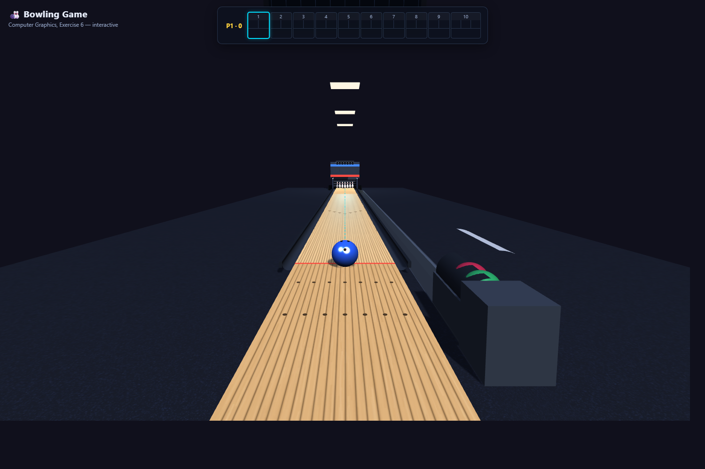 | 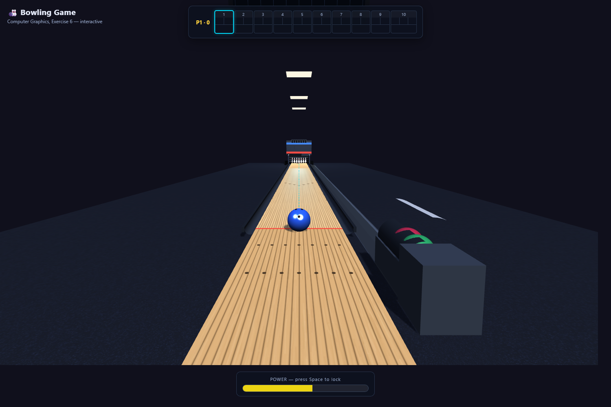 |

| Hook / accuracy meter | Roll in progress (follow cam) |
| --- | --- |
| 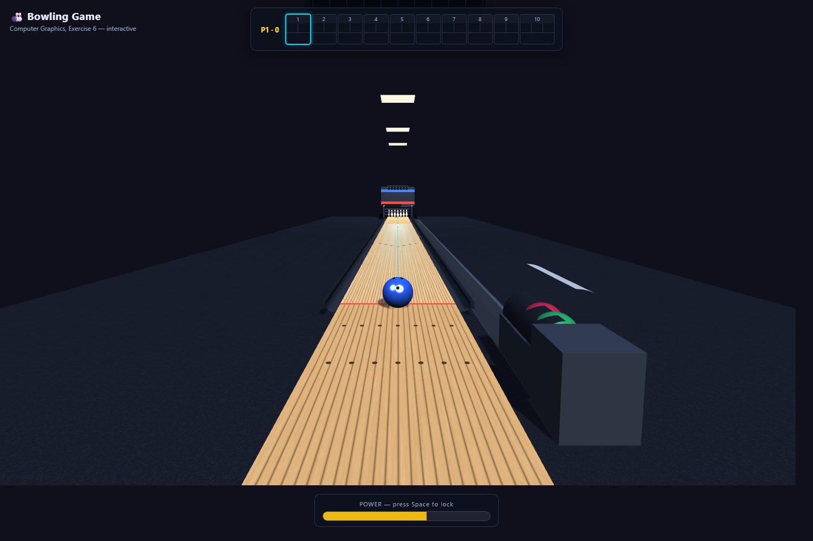 | 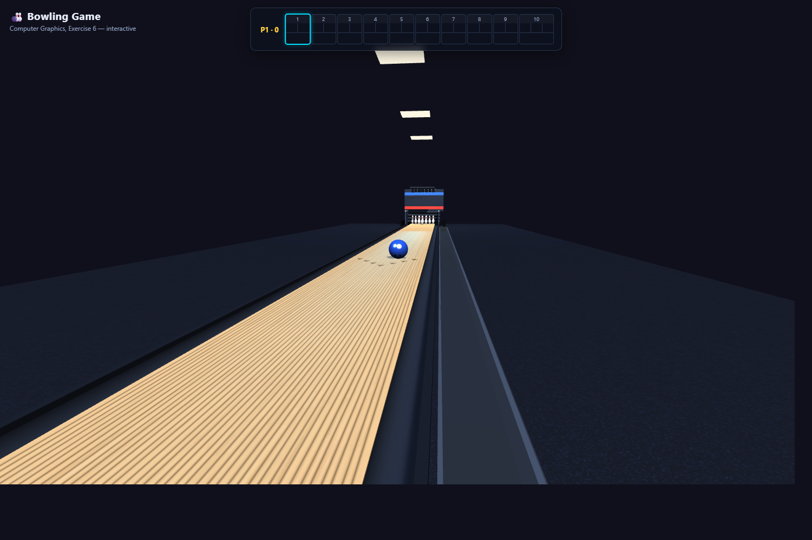 |

| Result (camera holds on the pins) | Gutter ball |
| --- | --- |
| 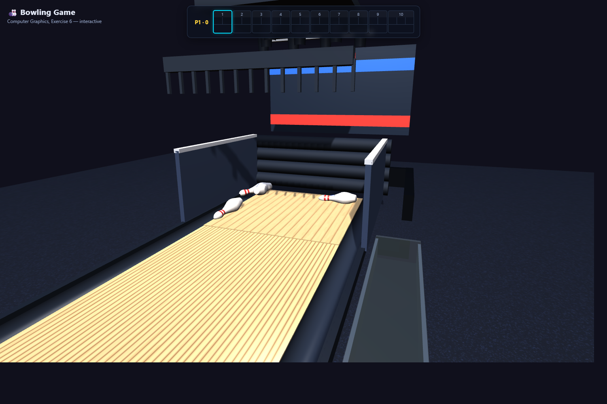 | 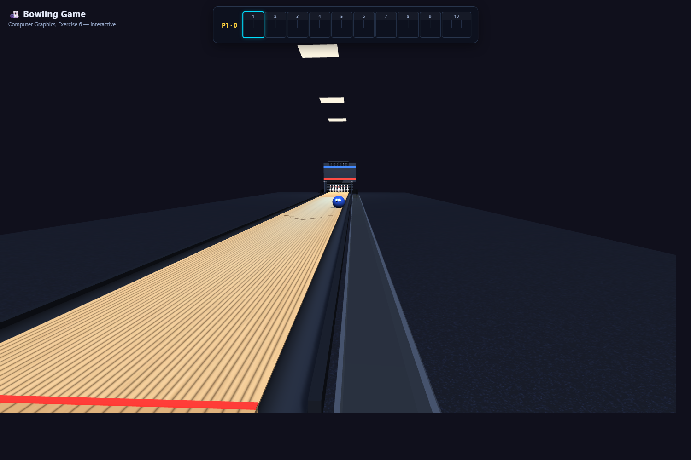 |

| Live overhead scoreboard | |
| --- | --- |
| 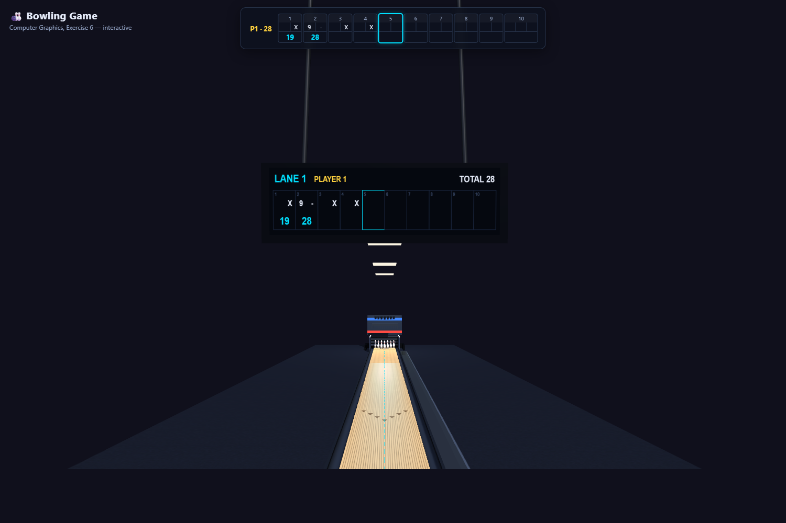 | |

Bonus systems (pin deck with kickback plates, the pinsetter mid-cycle with the
standing pins lifted while the rake clears the deadwood, and the ball returning
into the rack):

| Pin deck + kickbacks | Pinsetter cycle | Ball return |
| --- | --- | --- |
| 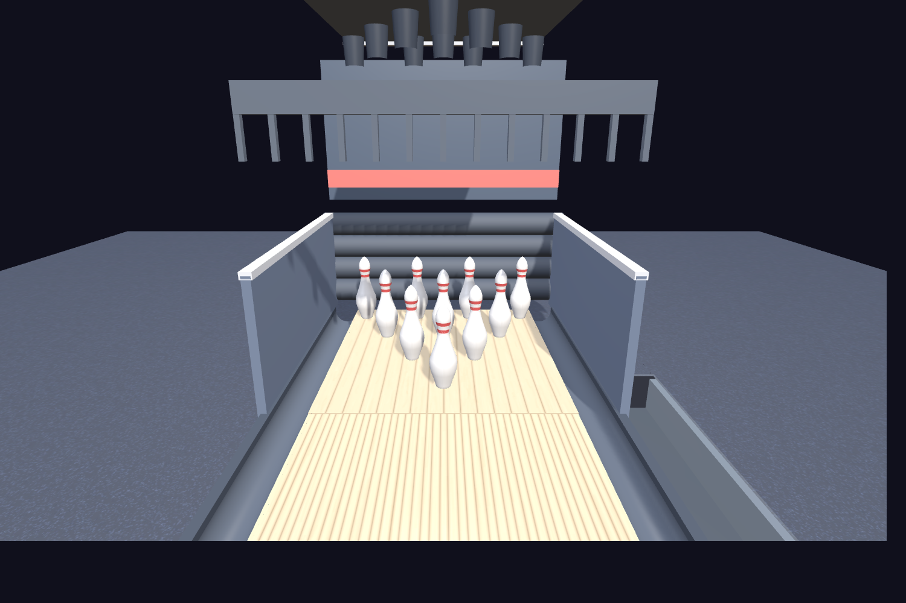 | 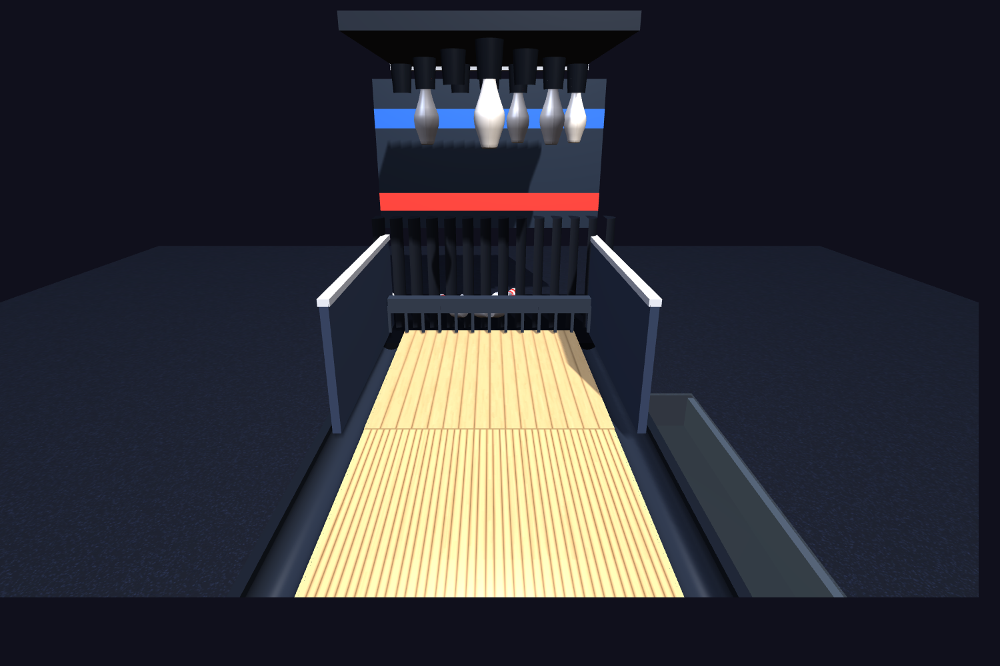 | 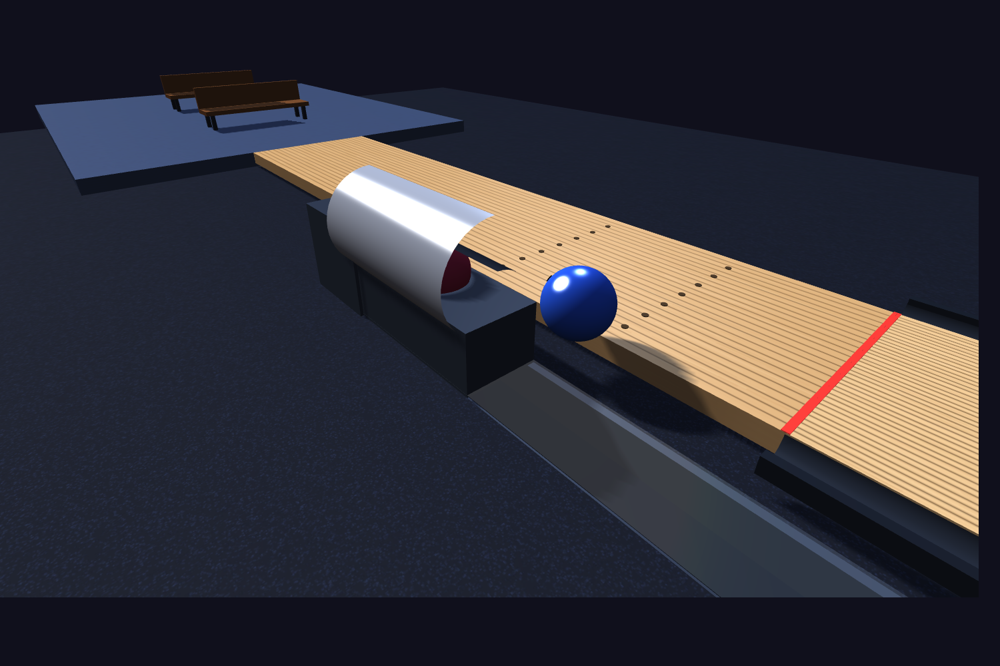 |

| Lane oil pattern | Two-player mode |
| --- | --- |
| 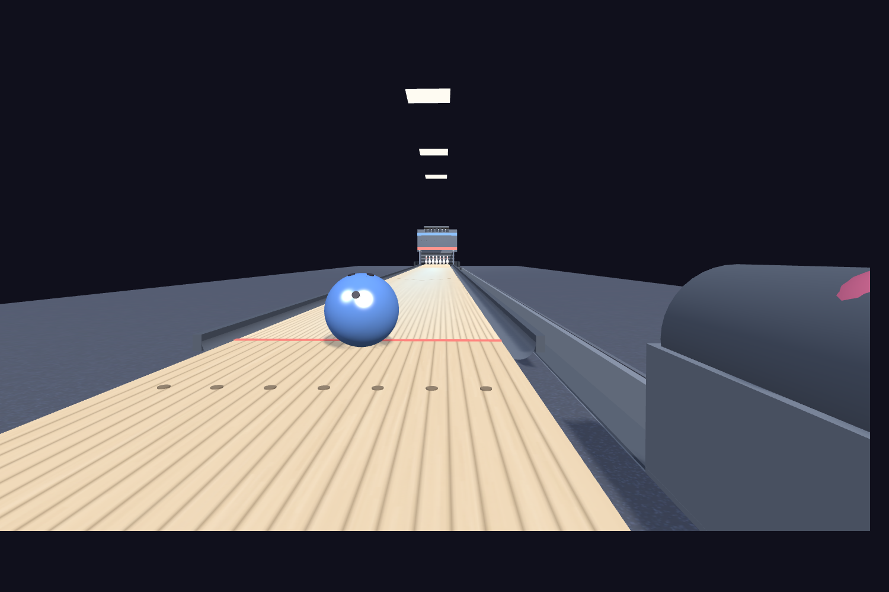 | 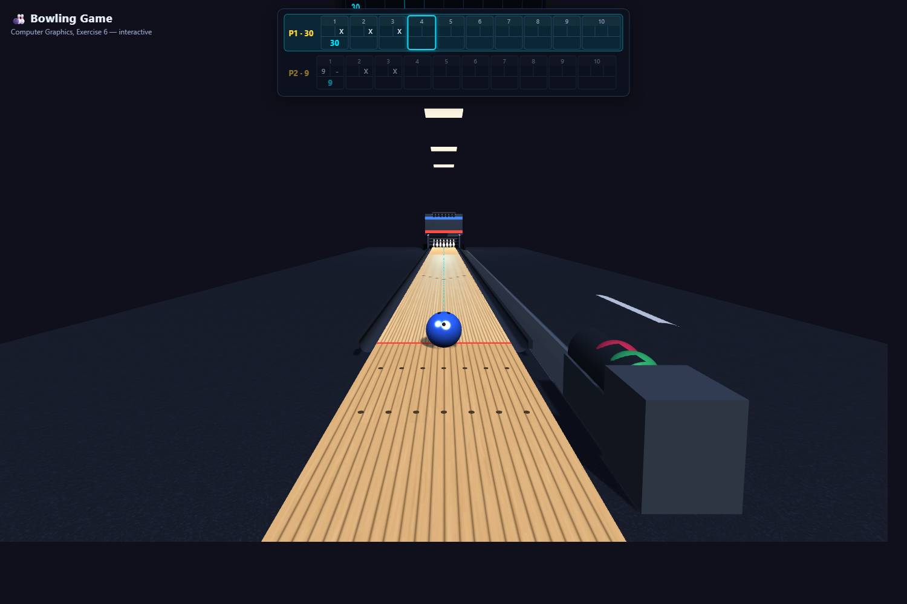 |

## Known Limitations

- The physics is hand-written impulse response (no physics engine): collisions
  are circle-vs-circle in the lane plane, and a pin's tumble is animated rather
  than a full rigid-body solve, so it approximates real pin action.
- The lane-oil model is a simplified two-zone version (oiled front, dry back) that
  scales the hook by lane position; it is not a full board-by-board friction map.

## Physics References

The collision math and the bowling tuning follow these:

- Impulse / restitution collision response — Newcastle University game-physics
  notes, Gaffer On Games, and the Euclideanspace 2D-collision article.
- Bowling pin action and pocket geometry — USC Illumin "Striking Physics" and the
  National Bowling Academy "Aiming for the Pocket" article.

## External Assets and Credits

- Three.js r128, loaded from the cdnjs CDN (MIT license).
- OrbitControls, vendored from the Three.js examples (unmodified).
- All textures and sound effects are generated in code; no external image,
  audio or model files are used.
